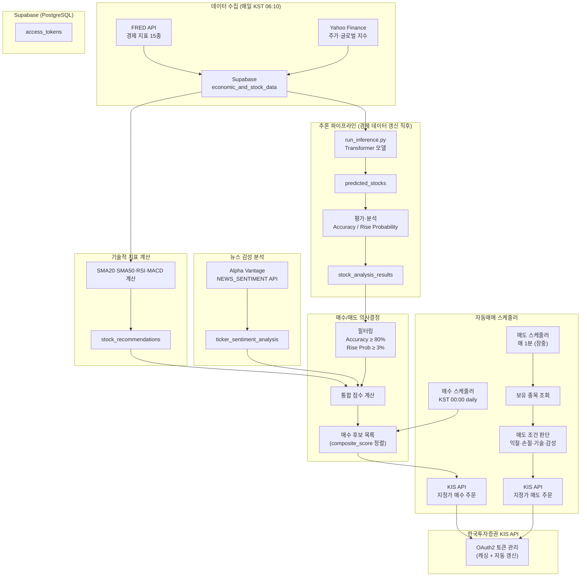

# Trader AI — 시스템 문서

미국 주식 자동매매 시스템. 경제 지표 + 주가 데이터를 Transformer 모델로 예측하고, 기술적 지표 및 뉴스 감성 분석을 결합해 자동 매수/매도를 실행한다.

---

## 목차

1. [전체 아키텍처](#전체-아키텍처)
2. [데이터 수집](#데이터-수집)
3. [예측 모델](#예측-모델)
4. [뉴스 감성 분석](#뉴스-감성-분석)
5. [증권 API (한국투자증권 KIS)](#증권-api-한국투자증권-kis)
6. [매수 조건 및 알고리즘](#매수-조건-및-알고리즘)
7. [매도 조건 및 알고리즘](#매도-조건-및-알고리즘)
8. [스케줄링](#스케줄링)
9. [데이터베이스 스키마](#데이터베이스-스키마)

---

## 전체 아키텍처



---

## 데이터 수집

`stock.py` — `collect_economic_data()` 함수가 두 외부 소스에서 데이터를 수집해 `economic_and_stock_data` 테이블에 저장한다.

### FRED API (경제 지표 15종)

| FRED 코드 | 지표명 | 주기 |
|-----------|--------|------|
| T10YIE | 10년 기대 인플레이션율 | 일간 |
| T10Y2Y | 장단기 금리차 (10년-2년) | 일간 |
| FEDFUNDS | 기준금리 | 월간 |
| UMCSENT | 미시간대 소비자 심리지수 | 월간 |
| UNRATE | 실업률 | 월간 |
| DGS2 | 2년 만기 미국 국채 수익률 | 일간 |
| DGS10 | 10년 만기 미국 국채 수익률 | 일간 |
| STLFSI4 | 금융 스트레스 지수 | 주간 |
| PCE | 개인 소비 지출 | 월간 |
| CPIAUCSL | 소비자 물가지수 | 월간 |
| MORTGAGE5US | 5년 변동금리 모기지 | 주간 |
| DTWEXM | 미국 달러 환율 | 월간 |
| M2 | 통화 공급량 M2 | 주간 |
| TDSP | 가계 부채 비율 | 분기 |
| GDPC1 | GDP 성장률 | 분기 |
| NASDAQCOM | 나스닥 종합지수 | 일간 |

> 월간·분기 지표는 forward-fill로 일간 데이터로 변환된다.

### Yahoo Finance (주가 및 글로벌 지수)

| 분류 | 종목 |
|------|------|
| 미국 지수 | S&P 500, 나스닥 100, VIX, 다우 존스 ETF, 러셀 2000 ETF |
| 미국 ETF | SPY, QQQ, 미국 전체 채권시장, TIPS, 투자등급 회사채, 미국 리츠 |
| 글로벌 지수 | 닛케이 225, 상해종합, 항셍, 영국 FTSE, 독일 DAX, 프랑스 CAC 40 |
| 외환 | 달러/엔, 달러/위안, 달러 인덱스, 금 가격 |
| 개별 주식 | 애플, 마이크로소프트, 아마존, 구글A/C, 메타, 테슬라, 엔비디아 외 18종 |

---

## 예측 모델

### 모델 구조

Transformer 기반 멀티 인풋 주가 예측 모델.

```
[주가 시계열 입력 (lookback=90일, 27종목)]
        ↓
  [Stock Encoder]
        ↓
           ╔══════════════════╗
           ║  Transformer     ║  ← Multi-head Self-Attention
           ║  (시계열 패턴)   ║
           ╚══════════════════╝
                   ↑
[경제 지표 입력 (lookback=90일, 37개 피처)]
        ↓
  [Econ Encoder]
        ↓

  [Dense Layers]
        ↓
[출력: 27종목의 t+14일 예측 주가]
```

| 항목 | 값 |
|------|----|
| 모델 파일 | `predict_model/model/v1_260504/transformer_stock.keras` |
| lookback | 90일 |
| forecast_horizon | 14일 |
| 주가 입력 차원 | 27 |
| 경제 지표 입력 차원 | 37 |
| 스케일러 | `stock_scaler.pkl` (주가), `econ_scaler.pkl` (경제 지표) |

### 입력 데이터

**주가 (27종목, target_columns)**

애플, 마이크로소프트, 아마존, 구글 A, 구글 C, 메타, 테슬라, 엔비디아, 코스트코, 넷플릭스, 페이팔, 인텔, 시스코, 컴캐스트, 펩시코, 암젠, 허니웰 인터내셔널, 스타벅스, 몬델리즈, 마이크론, 브로드컴, 어도비, 텍사스 인스트루먼트, AMD, 어플라이드 머티리얼즈, S&P 500 ETF, QQQ ETF

**경제 지표 (37개, economic_features)**

FRED 15종 + Yahoo Finance 글로벌 지수·ETF·외환 22종

### 예측값 및 평가 지표

| 지표 | 설명 |
|------|------|
| Accuracy (%) | `100 - MAPE` |
| MAE / MSE / RMSE | 예측 오차 |
| Rise Probability (%) | `(predicted - actual) / actual * 100` |
| Recommendation | Rise Prob > 2% → `STRONG BUY`, > 0% → `BUY`, 그 외 → `SELL` |

### 추론 흐름

```
Supabase economic_and_stock_data
        ↓ (전체 로드, ffill·bfill 처리)
run_prediction_pipeline()
  - stock_scaler, econ_scaler로 정규화
  - 슬라이딩 윈도우 (lookback=90) 배치 생성
  - model.predict([x_stock, x_econ])
  - inverse_transform → 실제 주가 단위
        ↓
predicted_stocks 테이블 저장
        ↓
evaluate_predictions() + analyze_rise_predictions()
        ↓
stock_analysis_results 테이블 저장
```

---

## 뉴스 감성 분석

**API**: Alpha Vantage `NEWS_SENTIMENT`

분석 대상: 추천 주식(Accuracy ≥ 80%, Rise Prob ≥ 3%) + 현재 보유 주식

```python
# 요청 파라미터
params = {
    "function": "NEWS_SENTIMENT",
    "tickers": ticker,
    "time_from": "최근 3일 전 00:00",
    "limit": 100,
    "apikey": api_key
}
```

| 항목 | 값 |
|------|----|
| relevance_score 필터 | ≥ 0.2 (관련성 낮은 기사 제외) |
| 복수 API 키 | MAIN / SUB_1 / SUB_2 → 병렬 스레드 처리 |
| 요청 간 지연 | 단일 키 5초, 복수 키 15초 |
| 저장 테이블 | `ticker_sentiment_analysis` |

**감성 점수 계산**

```python
average_sentiment = sum(ticker_sentiment_scores) / len(articles)
# ticker_sentiment_score: -1.0 (매우 부정) ~ +1.0 (매우 긍정)
```

---

## 증권 API (한국투자증권 KIS)

`app/services/balance_service.py`

### 인증 (OAuth2)

```
POST /oauth2/tokenP
  grant_type=client_credentials
  appkey / appsecret
→ access_token (유효기간 ~24시간)
```

토큰은 메모리 캐시 + Supabase `access_tokens` 테이블에 저장되어 재사용된다. 만료 전에는 DB에서 읽고, 만료 후에는 자동 갱신 (최대 3회 재시도, EGW00133 오류 시 61초 대기).

### 모의/실전 전환

`.env`의 `KIS_USE_MOCK=true/false`로 전환. TR_ID가 자동으로 모의(`V`prefix) / 실전(`T`prefix)으로 분기된다.

### 주요 API 엔드포인트

| 기능 | 엔드포인트 | TR_ID (실전) |
|------|-----------|-------------|
| 해외주식 잔고 조회 | `/uapi/overseas-stock/v1/trading/inquire-balance` | TTTS3012R |
| 해외주식 매수 (미국) | `/uapi/overseas-stock/v1/trading/order` | TTTT1002U |
| 해외주식 매도 (미국) | `/uapi/overseas-stock/v1/trading/order` | TTTT1006U |
| 현재체결가 조회 | `/uapi/overseas-price/v1/quotations/price` | HHDFS00000300 |
| 주문·체결 조회 | `/uapi/overseas-stock/v1/trading/inquire-order` | TTTS3035R |
| 예약주문 접수 | `/uapi/overseas-stock/v1/trading/order-resv` | TTTT3014U/3016U |

지원 거래소: `NASD` (나스닥), `NYSE` (뉴욕), `AMEX` (아멕스)

---

## 매수 조건 및 알고리즘

### 1단계: ML 모델 필터링 (`stock_analysis_results`)

```
Accuracy (%) ≥ 80
AND Rise Probability (%) ≥ 3
```

### 2단계: 기술적 지표 필터링 (`stock_recommendations`)

최근 6개월 일봉 데이터 기반. 아래 3가지 중 **1개 이상** 충족하는 종목만 통과:

| 지표 | 매수 신호 조건 |
|------|--------------|
| 골든 크로스 | SMA20 > SMA50 |
| RSI | RSI < 50 |
| MACD | MACD 라인 > Signal 라인 |

### 3단계: 통합 필터링 및 점수 계산

| 조건 | 요구 사항 |
|------|----------|
| 감성 점수 ≥ 0.15인 경우 | 기술적 지표 2개 이상 충족 |
| 감성 점수 < 0.15 또는 없는 경우 | 기술적 지표 3개 모두 충족 |

**종합 점수 (composite_score)**

```python
composite_score = (
    0.3 * rise_probability     # ML 예측 상승 확률
  + 0.4 * tech_conditions_count  # 기술적 지표 (골든크로스 1.5, RSI·MACD 각 1.0)
  + 0.3 * sentiment_score      # 뉴스 감성 점수
)
```

결과는 composite_score 내림차순으로 정렬되어 매수 우선순위가 결정된다.

### 4단계: 주문 실행

- 이미 보유 중인 종목은 제외
- 거래소 기본값: NASDAQ
- 주문 유형: 지정가 (`ORD_DVSN=00`)
- 매수 수량: 기본 1주 (현재 하드코딩, 추후 계좌 잔고 연동 예정)

---

## 매도 조건 및 알고리즘

`get_stocks_to_sell()` — 보유 종목 전체에 대해 아래 조건을 순서대로 평가한다.

### 조건 1: 가격 기반 (익절/손절)

```
구매가 대비 현재가 변동률:
  ≥ +5%  → 익절 매도
  ≤ -7%  → 손절 매도
```

### 조건 2: 감성 + 기술적 복합 신호

```
뉴스 감성 점수 < -0.15
AND 기술적 매도 신호 ≥ 2개
```

### 조건 3: 순수 기술적 신호

```
기술적 매도 신호 ≥ 3개 (모두 충족)
```

**기술적 매도 신호 3가지**

| 신호 | 조건 |
|------|------|
| 데드 크로스 | SMA20 < SMA50 (골든 크로스 없음) |
| RSI 과매수 | RSI > 70 |
| MACD 매도 | MACD 라인 < Signal 라인 |

### 매도 주문 실행

- 매도 조건 충족 종목: 절대 가격 변동률 기준 내림차순 정렬
- 현재체결가 조회 후 지정가 전량 매도
- API 속도 제한 방지: 요청 간 2초 대기

---

## 스케줄링

`app/utils/scheduler.py` — Python `schedule` 라이브러리 + 데몬 스레드

```mermaid
gantt
    title 일일 스케줄 (KST 기준)
    dateFormat HH:mm
    axisFormat %H:%M

    section 경제 데이터
    경제·주가 데이터 수집     :06:10, 30m
    Transformer 추론 (자동)   :06:40, 10m

    section 매수
    자동 매수 실행            :00:00, 5m

    section 매도 (미국 장중)
    매도 조건 체크 (1분 주기) :22:30, 390m
```



| 스케줄러 | 실행 시간 | 설정 키 |
|---------|----------|---------|
| 경제 데이터 수집 | KST 06:10 (매일) | `SCHEDULE_ECONOMIC_UPDATE_TIME` |
| 자동 매수 | KST 00:00 (매일) | `SCHEDULE_AUTO_BUY_TIME` |
| 자동 매도 체크 | 매 1분 (미국 장중만) | `SCHEDULE_AUTO_SELL_INTERVAL_MIN` |

**미국 장 시간 판단 (서머타임 자동 적용)**

```python
# pytz America/New_York 기준
# 평일 (월~금) 09:30 ~ 16:00 ET
is_market_hours = is_weekday and is_market_open_time
```

**경제 데이터 갱신 후 추론 자동 실행**

```
SCHEDULE_AFTER_ECONOMIC_RUN_INFERENCE=true (기본값)
→ 경제 데이터 갱신 시 신규 행이 1개 이상이면
  run_inference_and_save_to_db() 자동 호출
```

---

## 데이터베이스 스키마

Supabase (PostgreSQL) 사용.

| 테이블 | 용도 |
|--------|------|
| `economic_and_stock_data` | 경제 지표 + 주가 일간 데이터 (2006~) |
| `predicted_stocks` | Transformer 모델 예측 결과 (날짜별 종목별 예측가·실제가) |
| `stock_analysis_results` | 예측 평가 + 상승 확률 + 추천 등급 |
| `stock_recommendations` | 기술적 지표 분석 결과 (SMA, RSI, MACD, 골든크로스) |
| `ticker_sentiment_analysis` | Alpha Vantage 뉴스 감성 점수 (ticker별 평균) |
| `access_tokens` | KIS OAuth2 토큰 캐시 |

