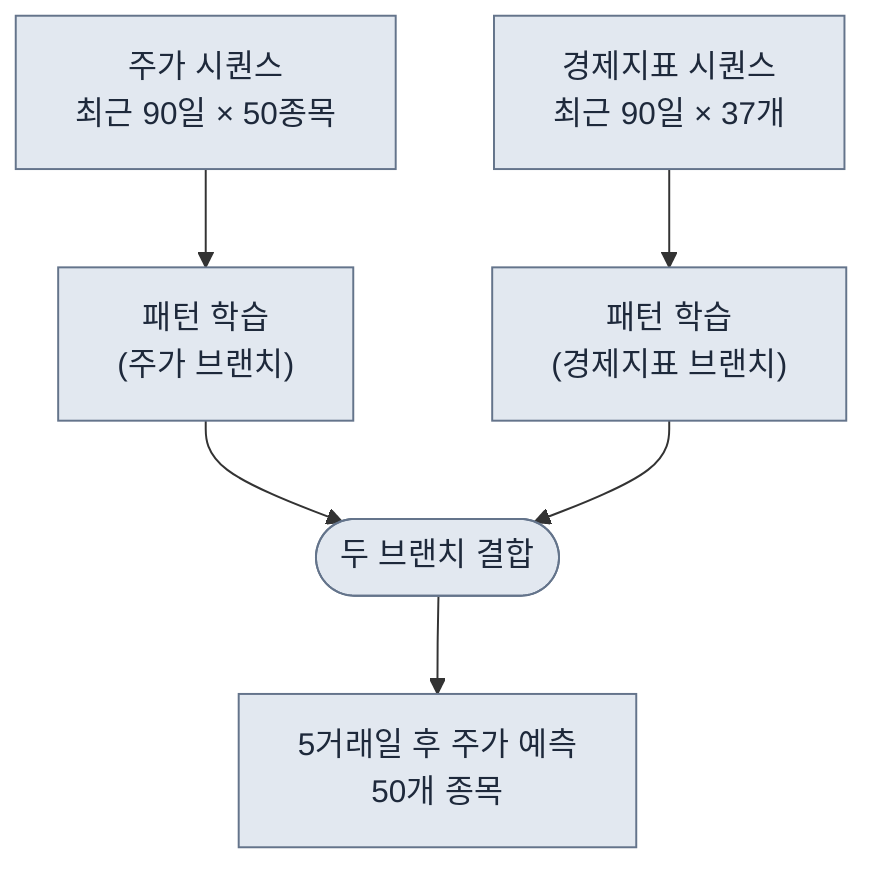
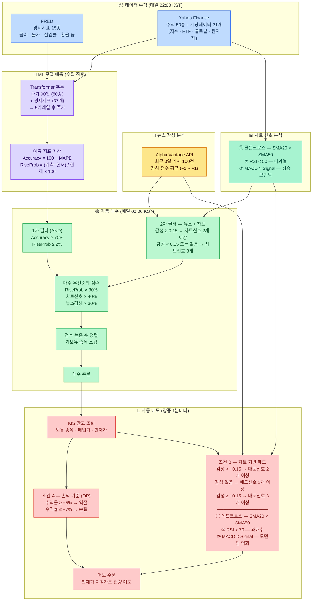

# 미국 주식 자동매매 시스템

딥러닝 모델로 주가를 예측하고, 차트 지표와 뉴스 감성을 규칙에 대입해 미국 주식을 자동으로 매매하는 퀀트 트레이딩 시스템

> 현재는 LLM을 사용하지 않고, 아래 두 가지 방식을 사용함.
> - **ML 모델 기반**: 과거 데이터를 학습한 Transformer 딥러닝 모델이 주가를 예측
> - **규칙 기반**: RSI·MACD 같은 차트 지표와 뉴스 감성 점수를 사전에 정의된 조건에 대입해 매수·매도를 결정

---

## 목차

1. [AI 예측 모델](#ai-예측-모델)
2. [전체 흐름](#전체-흐름)
3. [매매 대상 종목 (50개)](#매매-대상-종목-50개)
4. [데이터 수집](#데이터-수집)
5. [뉴스 감성 분석](#뉴스-감성-분석)
6. [증권사 연결 (KIS)](#증권사-연결-kis)
7. [매수 조건](#매수-조건)
8. [매도 조건](#매도-조건)
9. [스케줄링](#스케줄링)

---

## AI 예측 모델

### 목표

타겟 50개 종목의 **5거래일 후 종가**를 예측하는 멀티아웃풋 회귀 모델이다.

| 구분 | 내용 |
|------|------|
| 입력 A | 타겟 50개 종목의 최근 90일 종가 시퀀스 |
| 입력 B | 거시·시장·환율·원자재 경제지표 시퀀스 (37개) |
| 출력 | 50개 종목 각각의 5거래일 후 종가 (벡터 50개) |

### 모델 구조 — 2-Branch Transformer

- **전체 구조**: 2-브랜치 Transformer — 주가 브랜치 / 경제지표 브랜치를 독립적으로 인코딩한 뒤 합산
- **브랜치 구성**: 각 브랜치는 `Transformer 인코더 스택 → Dense → 특징벡터` 순으로 연결
- **Multi-Head Attention**: 시퀀스 내 각 시점 간의 상관관계를 학습 — 90일 중 어느 시점이 예측에 중요한지 스스로 파악
- **Feed-Forward Network (FFN)**: Attention 출력을 비선형 변환으로 정제
- **Fusion**: 두 브랜치의 특징벡터를 Add로 결합 → `Dense(128)`로 통합 표현 학습
- **Dropout**: 과적합 방지를 위해 Fusion 이후 적용
- **GlobalAveragePooling**: 시퀀스 전체를 고정 크기 벡터로 압축
- **출력층**: `Dense(50)` — 50개 종목 각각의 5거래일 후 종가를 동시에 회귀 예측



### 학습 설정

- **학습 방식**: 슬라이딩 윈도우 — 90일치 데이터로 5거래일 후 주가를 맞히는 방식으로 반복 학습
- **학습 샘플 수**: 7,295개 (전체 데이터에서 90+5거래일 제외)
- **검증셋**: 최근 30거래일을 분리해 과적합 여부 확인
- **학습 설정**: 최대 50 에포크, 배치 32, 학습률 0.0001 (성능 개선 없으면 조기 종료)
- **모델 파일 크기**: 약 8.5 MB

---

## 전체 흐름



### 용어 간단 정리

| 용어 | 설명 |
|------|------|
| SMA (이동평균) | 최근 N일 종가의 평균을 이은 선<br/>→ 주가가 전반적으로 오르는 중인지 내리는 중인지 보는 선 |
| 골든 크로스 | 단기 SMA가 장기 SMA를 위로 돌파<br/>→ 상승 전환 신호 |
| 데드 크로스 | 단기 SMA가 장기 SMA를 아래로 이탈<br/>→ 하락 전환 신호 |
| RSI | 최근 상승/하락 폭 비율로 과열·침체를 0~100으로 나타낸 지표<br/>→ 70 이상이면 너무 많이 올라 조정 가능, 30 이하면 너무 많이 내려 반등 가능 |
| MACD / Signal | 단기-장기 EMA 차이(MACD)와 그 평균선(Signal)<br/>→ MACD가 Signal을 위로 넘으면 오르는 힘 강화, 아래로 내려가면 약화 |
| MAPE | 예측값과 실제값의 평균 절대 백분율 오차 (Mean Absolute Percentage Error)<br/>수식: `mean(|실제 - 예측| / |실제|) × 100`<br/>→ 예측이 평균적으로 몇 % 빗나갔는지. 낮을수록 정확 |
| Accuracy (%) | 100 − MAPE<br/>→ AI 예측 정확도. 높을수록 잘 맞춤 |
| Rise Probability (%) | (예측가 − 현재가) / 현재가 × 100<br/>→ AI가 예측한 상승 여지(%). 양수면 오를 것으로 예측 |
| 뉴스 감성 점수 | 기사별 감성 점수를 평균한 값 (−1 ~ +1)<br/>→ 양수면 긍정적 뉴스, 음수면 부정적 뉴스가 많다는 뜻 |
| 익절 / 손절 | 목표 수익에 도달하면 팔아 이익 확정 / 일정 손실에 도달하면 팔아 추가 손실 방어<br/>→ 자동으로 수익을 챙기거나 손해를 막는 매도 |
| 지정가 주문 | 내가 원하는 가격을 지정해 주문하는 방식<br/>→ 시스템은 현재가를 지정가로 써서 즉시 체결되도록 함 |
| 장중 | 미국 거래소가 실제로 열려 거래 가능한 시간<br/>→ 한국 시간 기준 밤 10:30 ~ 새벽 5:00 (서머타임 적용 시) |

---

## 매매 대상 종목 (50개)

나스닥 100 지수 편입 종목 중 시가총액 상위 50개를 선정했다. 유동성이 높고 시장 대표성이 있는 대형주 위주로 구성되어 있다.

| 섹터 | 종목 |
|------|------|
| 반도체 | 엔비디아, 브로드컴, 마이크론, AMD, ASML, 인텔, 램리서치, 어플라이드 머티리얼즈, 텍사스 인스트루먼트, KLA Corp, Arm, 아나로그디바이스, 샌디스크, 퀄컴, 마벨 테크놀로지 |
| 빅테크 | 애플, 마이크로소프트, 아마존, 구글, 메타, 테슬라 |
| 소프트웨어·플랫폼 | 넷플릭스, 팔란티어, 쇼피파이, 앱러빈, 팔로알토 네트웍스, 인튜이트, 어도비, 케이던스, 시놉시스 |
| 통신·네트워크 | 시스코, 티모바일, 컴캐스트 |
| 소비재·유통 | 월마트, 코스트코, 스타벅스, 메르카도리브레, 몬델리즈 |
| 헬스케어·바이오 | 암젠, 인튜이티브 서지컬, 버텍스 파마슈티컬스 |
| 기타 | 린드, 펩시코, 씨게이트, 허니웰 인터내셔널, 부킹홀딩스, 콘스텔레이션 에너지, ADP, 에어비앤비, 메리어트 |

---

## 데이터 수집

매일 22시 00분(한국 시간), 두 곳에서 데이터를 가져온다.

### 미국 경제 지표 — FRED

> **사이트**: https://fred.stlouisfed.org

> 미국 연방준비제도(Fed)가 운영하는 공식 경제 데이터 플랫폼. 금리·물가·실업률 등 미국 거시경제 지표를 무료로 제공한다.

미국 거시경제 상황을 나타내는 지표 15종을 수집한다.
> 글로벌 지수는 FRED가 아니라 Yahoo Finance에서 별도로 수집한다.

| 지표 | 의미 |
|------|------|
| 기준금리 | 미국 중앙은행이 설정하는 이자율 |
| 소비자 물가지수 (CPI) | 물가 상승률 |
| 실업률 | 일자리를 못 찾는 사람 비율 |
| GDP 성장률 | 경제가 얼마나 성장했는지 |
| 장단기 금리차 | 단기·장기 국채 금리 차이 (경기 침체 예측 지표) |
| 소비자 심리지수 | 사람들이 경기를 어떻게 느끼는지 |
| 달러 환율 | 달러 강도 |
| 금융 스트레스 지수 | 금융 시장의 불안 정도 |
| 통화량 M2 | 시중에 풀린 돈의 양 |
| 모기지 금리 | 주택 담보 대출 금리 |
| 개인 소비 지출 (PCE) | 가계 소비 동향 |
| 국채 수익률 (2년·10년) | 시장 금리 수준 |
| 가계 부채 비율 | 가계의 채무 부담 |

### 주가 및 시장 데이터 — Yahoo Finance

> **사이트**: https://finance.yahoo.com

> 전 세계 주식·지수·ETF·환율 데이터를 무료로 제공하는 금융 정보 플랫폼. 개별 종목의 일별 가격 히스토리를 가져오는 데 사용한다.

개별 주식과 시장 전반의 흐름을 파악하기 위한 데이터를 수집한다.

| 분류 | 항목 |
|------|------|
| 개별 주식 (50개) | 나스닥 100 시총 상위 50종목 (매매 대상과 동일) |
| 미국 지수 (5개) | S&P 500, 나스닥 100, 다우존스, VIX (공포지수), 러셀 2000 |
| 미국 ETF (6개) | SPY, QQQ, 채권 ETF, TIPS, 투자등급 회사채, 리츠 |
| 글로벌 지수 (6개) | 일본 닛케이, 중국 상해, 홍콩 항셍, 영국 FTSE, 독일 DAX, 프랑스 CAC 40 |
| 외환·원자재 (4개) | 달러/엔, 달러/위안, 달러 인덱스, 금 가격 |

> 개별 주식(50개) **제외**: 총 21개 (미국 지수 5 + 미국 ETF 6 + 글로벌 지수 6 + 외환·원자재 4)  
> 개별 주식(50개) **포함**: 총 71개

---

## 뉴스 감성 분석

### 데이터 출처 — Alpha Vantage

> **사이트**: https://www.alphavantage.co

금융 데이터 전문 플랫폼으로, 주식 가격뿐 아니라 뉴스 기사의 감성을 분석한 점수를 API로 제공한다. `NEWS_SENTIMENT` 엔드포인트를 사용하면 특정 종목(ticker)에 대한 최신 뉴스 기사와 함께 기사별 감성 점수를 바로 받을 수 있다.

- 무료 플랜 존재 (분당 요청 수 제한 있음) → API 키를 여러 개 발급해 병렬 처리로 속도 보완
- 수집 기준: 최근 3일 이내 기사, 최대 100건 (`limit=100`)
- 종목과의 관련성(`relevance_score`)이 낮은 기사는 자동 제외

### 감성 점수 계산

각 기사에는 해당 종목에 대한 `ticker_sentiment_score`가 −1 ~ +1 범위로 붙어 있다. 이 점수들을 평균 내어 종목 하나당 대표 감성 점수를 산출한다.

| 점수 범위 | 의미 | 매매 영향 |
|-----------|------|-----------|
| +0.15 이상 | 긍정적 뉴스 우세 | 매수 시 차트신호 기준 완화 가능 |
| −0.15 ~ +0.15 | 중립 | 차트신호 기준 강화 |
| −0.15 미만 | 부정적 뉴스 우세 | 보유 중이면 매도 후보 검토 |
| 데이터 없음 | 뉴스 수집 실패 또는 기사 없음 | 감성 조건 제외, 차트신호만으로 판단 |

---

## 증권사 연결 (KIS)

한국투자증권 API를 통해 실제 주문을 낸다.

- **모의투자 / 실전투자** 전환 가능 (`.env` 파일에서 설정)
- 로그인 토큰은 자동으로 발급·갱신된다 (약 24시간마다)
- 지원 거래소: 나스닥, 뉴욕증권거래소(NYSE), 아멕스(AMEX)

---

## 매수 조건

3단계를 모두 통과한 종목만 매수한다.

### 1단계: AI 예측 통과

```
AI 정확도 ≥ 70%  AND  상승 확률 ≥ 2%
```

AI가 자신 있게 오를 것이라고 예측한 종목만 통과.

### 2단계: 차트 신호 확인

차트 분석 지표 3가지 중 1개 이상 충족해야 한다.

| 지표 | 매수 신호 | 의미 |
|------|---------|------|
| 골든 크로스 | 단기 평균 > 장기 평균 | 최근 주가 흐름이 살아나고 있음 |
| RSI | RSI < 50 | 아직 과열되지 않은 상태 |
| MACD | MACD > 시그널 라인 | 상승 모멘텀이 생기는 시점 |

> **용어 설명**: 이동평균은 일정 기간의 평균 주가를 이은 선이다. 단기(20일)가 장기(50일)를 위로 돌파하면 "골든 크로스"라 부르며 상승 신호로 본다.

### 3단계: 뉴스 + 차트 종합

- 뉴스 감성이 좋은 경우(점수 ≥ 0.15): 차트 신호 2개 이상
- 뉴스 감성이 중립/부정인 경우(점수 < 0.15) 또는 데이터 없음: 차트 신호 3개 이상

> 코드 기준: 매수 판단에서 뉴스 감성은 “필수 게이트”가 아니다.  
> - 감성 ≥ 0.15면 “긍정 감성”으로 분류되어(있는 경우) 차트 기준(≥2)을 적용하고, 종합 점수에 반영된다.  
> - 감성 데이터가 없거나 감성 < 0.15면 “감성 미충족/없음”으로 취급되어 차트 기준을 더 강화(≥3)한다.

통과한 종목은 아래 공식으로 점수를 계산해 높은 순으로 매수한다.

```
종합 점수 = (AI 상승 확률 × 30%) + (차트 신호 강도 × 40%) + (뉴스 점수 × 30%)
```

---

## 매도 조건

보유 중인 종목에 대해 1분마다 아래 조건을 확인한다. 하나라도 해당되면 전량 매도한다.

### 조건 1: 수익/손실 기준

```
+5% 이상 수익  →  익절 (이익 실현)
-7% 이상 손실  →  손절 (손실 방어)
```

### 조건 2: 나쁜 뉴스 + 차트 악화

```
뉴스 감성 점수 < -0.15  AND  차트 매도 신호 2개 이상
```

### 조건 3: 차트 전반 악화

```
차트 매도 신호 3개 모두 충족
```

### 매도 판단 규칙(우선순위/예외)

- **OR 조건**: 위 3개 조건 중 **하나라도** 충족하면 매도 후보로 분류된다. (조건이 여러 개 동시에 충족될 수 있으며, 이 경우 `sell_reasons`에 모두 기록)
- **감성 데이터가 없으면**: 뉴스 감성 점수가 없을 때는 “조건 2”를 평가할 수 없으므로, **차트 매도 신호 3개 이상**이면 매도 후보가 될 수 있다. (기본값: `SELL_TECH_MIN_WITHOUT_SENTIMENT=3`)
- **데이터 소스**
  - **수익/손실(변동률)**: KIS 잔고의 `평균매입가(pchs_avg_pric)`와 `현재가(now_pric2)`로 계산
  - **차트 신호**: Supabase `stock_recommendations`의 **종목별 최신 1행**(골든 크로스/RSI/MACD)
  - **뉴스 감성**: Supabase `ticker_sentiment_analysis.average_sentiment_score`
- **처리 순서**: 매도 후보는 **변동률 절대값이 큰 종목부터** 처리한다.
- **주문 방식**: 자동 매도는 기본적으로 **전량 지정가 주문(현재가로 지정)**을 사용한다. (주문 성공/실패 및 사유는 로그/일일 주문 히스토리에 남는다)

**차트 매도 신호 3가지**

| 신호 | 조건 | 의미 |
|------|------|------|
| 데드 크로스 | 단기 평균 < 장기 평균 | 주가 흐름이 하락 전환 |
| RSI 과매수 | RSI > 70 | 주가가 너무 많이 올라 조정 가능성 |
| MACD 매도 | MACD < 시그널 라인 | 상승 모멘텀 소진 |

---

## 스케줄링

시스템이 자동으로 실행되는 시간표 (한국 시간 기준).

```mermaid
gantt
    title 일일 스케줄 (KST 기준)
    dateFormat HH:mm
    axisFormat %H:%M

    section 데이터·예측
    경제·주가 데이터 수집     :22:00, 30m
    AI 예측 자동 실행         :22:30, 10m

    section 매수
    자동 매수 실행            :00:00, 5m

    section 매도 (미국 장중)
    매도 조건 체크 (1분 주기) :22:30, 390m
```



| 작업 | 실행 시간 |
|------|---------|
| 경제 데이터 수집 + AI 예측 | 매일 22:00 |
| 자동 매수 | 매일 자정 (00:00) |
| 자동 매도 체크 | 미국 장중 (한국 시간 22:30~05:00) 매 1분 |

> 미국 주식 장은 한국 시간으로 밤 10시 30분~새벽 5시에 열린다 (서머타임 적용 시).
